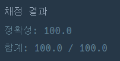

## [프로그래머스 Lv3. 풍선 터트리기](https://school.programmers.co.kr/learn/courses/30/lessons/68646)

> 문제의 키워드

- 서로 다른 숫자
- 1개만 남을 때까지 제거
- 인접한 수 중 자신보다 큰 수만 제거 가능, 작은 수는 한 번만

<br/>

> 접근법 분석

- 입력 배열 a의 길이는 1 부터 1,000,000
  - 일반적인 배열 완전 탐색은 N²의 시간이 걸리기 때문에 시간 초과 발생 가능
  - <strong>그리디 문제로 판단</strong>

<br/>

> 그리디 접근법

- 자신의 왼쪽 구간에서 가장 작은 수와 자신의 오른쪽 구간에서 가장 작은 수를 가져와 <u>두 수보다 모두 크다면</u> 남길 수 없는 수
  - 왼쪽 구간에서 가장 작은 수로 왼쪽 구간의 숫자들을 모두 제거
  - 오른쪽 구간에서 가장 작은 수로 오른쪽 구간의 숫자들을 모두 제거
  - 남은 `[ 왼쪽에서 가장 작은 수, 선택된 수, 오른쪽에서 가장 작은 수 ]` 중에서 한 번은 작은 수를 제거할 수 있기 때문에 3개의 숫자 중 선택된 수가 가장 큰 수가 아니라면 남길 수 있는 숫자라고 판단

<br/>

> 구현 접근법

- 구간의 최솟값
  - 구간에서의 누적합, 최솟값, 최댓값은 세그먼트 트리를 구성하여 탐색
  - 현재 문제는 구간 내에서 값 갱신이 일어나지 않고 범위가 정해져 있으므로 세그먼트 트리가 필요하지 않음
  - 배열 탐색을 통한 최솟값 배열 구성

<br/>

> 시간복잡도

#### O(N)

<br/>

### 구현 코드

```java
class Solution {
    public int solution(int[] a) {
        int answer = 0;

        int n = a.length;

        int[] larr = new int[n]; // 왼쪽 구간 최솟값 배열
        int[] rarr = new int[n]; // 오른쪽 구간 최솟값 배열

        int min;

        // 왼쪽 구간 최솟값 탐색
        min = Integer.MAX_VALUE;
        for(int i = 0; i < n; i++) {
            min = min < a[i] ? min : a[i];
            larr[i] = min;
        }

        // 오른쪽 구간 최솟값 탐색
        min = Integer.MAX_VALUE;
        for(int i = n - 1; i >= 0; i--) {
            min = min < a[i] ? min : a[i];
            rarr[i] = min;
        }

        // 정답 조건 판별 과정
        for(int i = 0; i < n; i++) {
            // 배열의 끝 부분이면 조건 통과
            if(i == 0 || i == n - 1) {
                answer++;
                continue;
            }
            // 양 최솟값보다 크다면 continue
            if(larr[i-1] < a[i] && rarr[i+1] < a[i])
                continue;
            answer++;
        }

        return answer;
    }
}
```

### 제출 결과



<br>

# 토론 접근법 풀이

<p> 내가 제시한 접근법을 정해로 보고 토론을 진행.</p>
<p> 한쪽에만 작은값이 나온다면 조건을 통해 제거 가능하지만, 양쪽에서 나오면 제거 불가능 </p>

#### 풀이 링크

[Private Solve](https://github.com/The-Four-Error-Pickers/Algorithm-Study/tree/main/Private%20Solve/68646.%20%ED%92%8D%EC%84%A0%20%ED%84%B0%ED%8A%B8%EB%A6%AC%EA%B8%B0/ChanHyeok/2024-10-27T205857)
