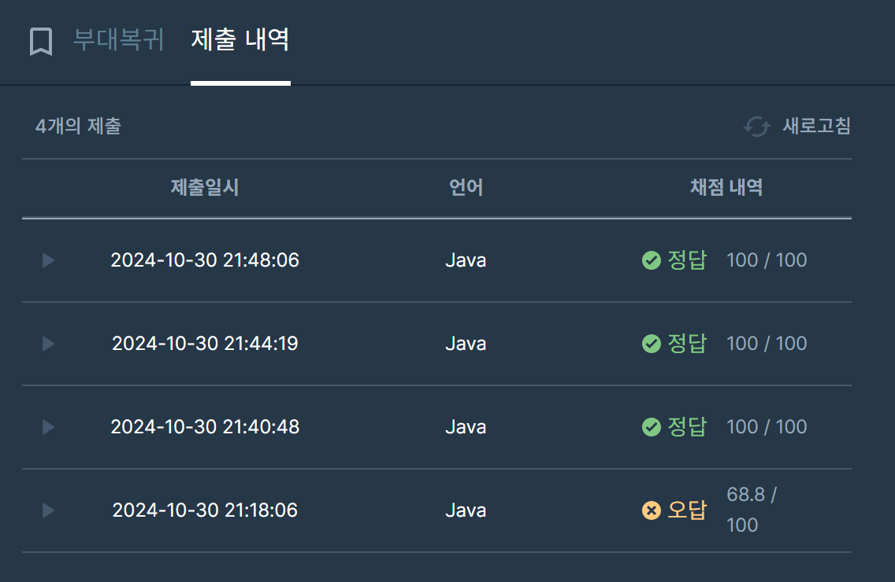

## [프로그래머스 Lv3. 부대 복귀](https://school.programmers.co.kr/learn/courses/30/lessons/132266)

> 키워드 유추
- 각 지역은 유일한 번호로 구분
- 걸리는 시간은 모두 1로 동일(가중치)
- 최단시간에 부대로 복귀(최단거리)
- 두 지역을 왕복할 수 있는 길(양방향)


> 접근법
<p> 목적지 destination에서 각 시작지점으로 향하는 최단거리를 다익스트라를 통해 탐색 </p>
<p> N이 최대 10만이므로 인접리스트로 초기화 </p>
<p> 각 지점별로 최단거리 리턴 </p>

> 시간복잡도
<p> O((V+E))logV) </p>
<p> V는 정점 수, E는 간선 수 </p>
<p> logV의 경우 힙 연산 </p>

> 풀이에 대한 정리
- 이번 문제는 비교적 간단한 다익스트라 문제였음에도 불구하고 20분내 풀이는 하지 못했음.
- 첫번째 시도는 도착지점에서 한번의 다익스트라로 최단거리를 구하는게 아닌, 각 시작지점에서 도착지점으로의 거리를 구함. -> 시간초과
- 시간을 줄이기위해 생각 도중, 목적지에서부터 다른정점으로의 최단거리를 한번 구하는 풀이로 변경했지만 틀림.
- 이후 찾아본 결과 도착정점을 입력변수로 넣은게 아닌, 0으로 고정된 값을 넣고 있었음.. (몽총이)

### 구현 코드
```java
import java.util.*;
class Solution {
    static List<List<Integer>> list;
    static int[] dist;
    public int[] solution(int n, int[][] roads, int[] sources, int destination) {
        /**
         각 지역은 유일한 번호로 구분
         걸리는 시간은 모두 1로 동일
         최단시간에 부대로 복귀
         임무의 시작 때와 다르게 되돌아오는 경로가 없어져 복귀가 불가능한 부대원도 있을 수 있습니다.
         **/
        
        list = new ArrayList<>();
        for(int i=0; i<n; i++) list.add(new ArrayList<>());
        
        for(int i=0; i<roads.length; i++) {
            int[] road = roads[i];
            list.get(road[0]-1).add(road[1]-1);
            list.get(road[1]-1).add(road[0]-1);
        }
        
        dist = new int[n];
        Arrays.fill(dist, Integer.MAX_VALUE);
        dist[destination-1] = 0;
        
        dijk(n, destination-1);
    
        
        int[] res = new int[sources.length];
        for(int i=0; i<sources.length; i++) {
            res[i] = dist[sources[i]-1] == Integer.MAX_VALUE ? -1 : dist[sources[i]-1];
        }
        return res;
    }
    
    private static void dijk(int n, int start) {
        PriorityQueue<int[]> pq = new PriorityQueue<>((o1,o2) -> o1[1] - o2[1]);
        pq.offer(new int[]{start,0});
        
        while(!pq.isEmpty()) {
            int[] cur = pq.poll();
            
            if(dist[cur[0]] < cur[1]) continue;
            
            for(int next : list.get(cur[0])) {
                if(dist[next] > cur[1]+1) {
                    pq.offer(new int[]{next, cur[1]+1});
                    dist[next] = cur[1]+1;
                }
            }
        }
        
        return;
    }
}
```

> 제출 결과



> 토론 정리
<p> 이번 문제의 경우 모두 다익스트라 혹은 BFS로 동일한 풀이를 했음. </p>

> 구현 알고리즘
<p> 다익스트라 or BFS </p>

> 풀이 링크
[Private Solve](https://github.com/The-Four-Error-Pickers/Algorithm-Study/tree/main/Private%20Solve/68646.%20%ED%92%8D%EC%84%A0%20%ED%84%B0%ED%8A%B8%EB%A6%AC%EA%B8%B0/Be-HinD(Ryo)/2024-10-27T234758)

