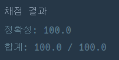

## [프로그래머스 Lv3. 부대 복귀](https://school.programmers.co.kr/learn/courses/30/lessons/132266)

> 문제의 키워드

- 최단 시간에 복귀
- 경로는 왕복 가능

<br/>
<br/>

> 접근법 분석
- destination을 start로 잡아서 모든 n을 탐색하더라도 방문체크만 잘 해준다면 문제 없을 거라고 생각(왜냐하면 아래의 시간복잡도에 의해서..)
- 또한, 경로에 대한 <strong>가중치는 없으므로(다익스트라 까진 필요X)</strong> PQ와 방문체크를 적절하게 사용하면 된다고 생각

<br/>


<br/>

> 시간복잡도

#### O(ElogE)

<br/>

### 구현 코드

```java
import java.util.*;

class Solution {
    
    class Node {
        int vertex;
        Node next;  // 연결리스트 유지를 위한 노드
        
        Node(int vertex, Node next) {
            this.vertex = vertex;
            this.next = next;
        } 
    }
    
    public int[] solution(int n, int[][] roads, int[] sources, int destination) {
        
        // BFS + PQ + 방문체크
        int[] answer = new int[sources.length];
        int[] distance = new int[n + 1];    
        boolean[] nVisited = new boolean[n + 1];  
        Arrays.fill(distance, -1);
        Node[] adjList = new Node[n + 1];   // 연결리스트 배열
        
        for(int i = 0; i < roads.length; i++) {
            int start = roads[i][0];
            int end = roads[i][1];
            
            adjList[start] = new Node(end, adjList[start]);
            adjList[end] = new Node(start, adjList[end]);
        }
        
        bfs(n, distance, nVisited, adjList, destination);
            
        for(int i = 0; i < sources.length; i++) {
            answer[i] = distance[sources[i]];
        }
        
        return answer;
    }
    
    // destination을 start로 해서 모든 road 탐색
    public void bfs(int n, int[] distance, boolean[] nVisited, Node[] adjList, int start) {
        PriorityQueue<int[]> pq = new PriorityQueue<>((o1, o2) -> Integer.compare(o1[1], o2[1]));
        pq.offer(new int[]{start, 0});
        int count = 0;
        
        while(!pq.isEmpty()) {
            int[] current = pq.poll();
            
            if(nVisited[current[0]]) continue;
            nVisited[current[0]] = true;
            distance[current[0]] = current[1];
            
            if(++count == n) break;
            
            for(Node temp = adjList[current[0]]; temp != null; temp = temp.next) {
                pq.offer(new int[] {temp.vertex, current[1] + 1});
            }
            
        }
    }
}
```

### 제출 결과



#### 풀이 링크

[Private Solve](https://github.com/The-Four-Error-Pickers/Algorithm-Study/tree/main/Private%20Solve/132266.%20%EB%B6%80%EB%8C%80%EB%B3%B5%EA%B7%80/JunHo/2024-10-30T23290)
