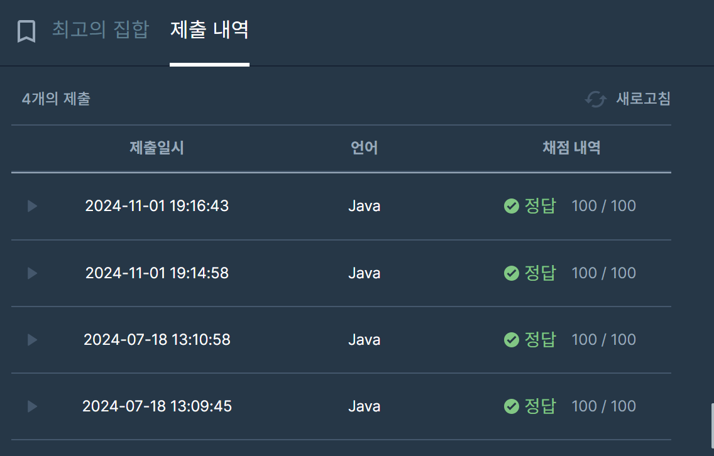

## [프로그래머스 Lv3. 최고의 집합](https://school.programmers.co.kr/learn/courses/30/lessons/12938)

> 키워드 유추
- n개의 자연수로 s를 만들어야함.
- 자연수곱 == 최대

> 접근법
<p> 예제를 통해 중복원소가 나와도 상관없음을 인지 </p>
<p> 간단하게 생각해볼 수 있는 최대 원소값은 s를 n으로 나눈 값이 됨. </p>
<p> n=2, s=9라면 4가 최고값 중 포함이 됨. </p>
<p> n이 여러개일 경우, 위처럼 현재 s와 n에서 구할 수 있는 최대값을 탐색해나감. </p>

> 시간복잡도
<p> O(N) </p>

### 구현 코드
```java
import java.util.Arrays;
class Solution {
    public int[] solution(int n, int s) {
        int[] res = new int[n];

        if(s/n == 0) return new int[]{-1};
    
        int idx = 0;
        n++;
        while(--n != 0) {
            res[idx++] = s / n;
            s -= res[idx-1];
        }
        System.out.println(Arrays.toString(res));
        return res;
    }
}
```

> 제출 결과


> 스터디 정리
- 이전에 풀었던 문제로, 초기화 후 다시 풀었을 때 똑같은 접근법으로 풀었음.
- 다른 스터디원과 다른 접근을 했다는 것을 토론을 통해 알 수 있었음.
- 균등하게 평탄화 작업이라는 생각을 들었는데, 나의 경우에는 나올 수 있는 최대값이 어떤값일지 생각함.
- 사실 내 코드에서 매번 최대값을 구하기 위해서는 몫이 아닌 나머지 값을 활용해야함.
- 그러나 오름차순 정렬을 위해서 몫 값을 활용했고, 내림차순이였다면 나머지 값을 활용하는 것으로 풀이가 가능.
- 해당 문제에 대해 다른 스터디원들의 풀이가 설명도 깔끔하고, 더 좋은 접근법이라 생각했다.

> 구현 알고리즘
<p> 그리디 </p>

> 풀이 링크

[Private Solve](https://github.com/The-Four-Error-Pickers/Algorithm-Study/tree/main/Private%20Solve/프로그래머스/12938.%20%EC%B5%9C%EA%B3%A0%EC%9D%98%20%EC%A7%91%ED%95%A9/Be-HinD(Ryo))

