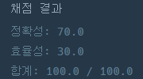

## [프로그래머스 Lv3. 최고의 집합](https://school.programmers.co.kr/learn/courses/30/lessons/12938)

> 문제의 키워드

- 자연수 n개로 이루어진 중복 집합

<br/>
<br/>

> 접근법 분석
- 합이 S가 되는 자연수 n들의 집합들 중 n들의 곱이 최대가 되려면 <strong>집합 n의 원소가 균등해야함</strong>
- 그래서 S를 n으로 나눈 값을 배열에 담고 나머지 S%n의 값을 배열을 순회하며 1씩 더해줌

<br/>

<br/>

> 알고리즘

#### 그리디, 수학


<br/>

> 시간복잡도

#### O(N)

<br/>

### 구현 코드

```java
import java.util.*;

class Solution {
    public int[] solution(int n, int s) {
    
        // 불가능한 경우
        if(n >= s) return new int[]{-1};
        
        // 풀이 : s를 n만큼 나누고 나머지 만큼 1씩 더해주면 최댓값이 됨
        int[] answer = new int[n];
        
        for(int i = 0; i < n; i++) answer[i] = s / n;
        
        int mod = s % n;
        int idx = 0;
        while(mod-- > 0) {
            answer[idx++]++;
        }
        
        Arrays.sort(answer);

        return answer;
    }
}
```

### 제출 결과



#### 풀이 링크

[Private Solve](https://github.com/The-Four-Error-Pickers/Algorithm-Study/tree/main/Private%20Solve/12938.%20%EC%B5%9C%EA%B3%A0%EC%9D%98%20%EC%A7%91%ED%95%A9/JunHo/2024-11-1T192358)
