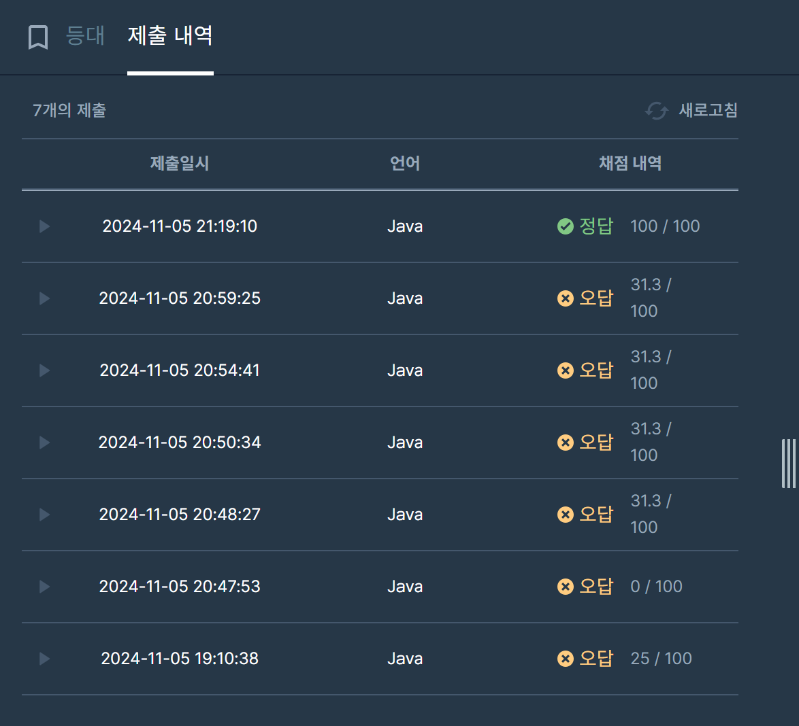

## [프로그래머스 Lv3. 등대](https://school.programmers.co.kr/learn/courses/30/lessons/133500)

> 키워드 유추
- 어느 등대에서 출발해도 다른 모든 등대까지 이동가능
- 한 뱃길의 양쪽 끝 등대 중 적어도 하나는 켜져 있도록 등대를 켜 두어야 합니다.
- lighthouse의 길이 = n – 1

> 접근법
<p> 모든 등대로 이동이 가능하고, 간선이 정확히 n-1개가 나오는 것을 통해 Cycle이 발생하지 않는 것으로 생각 </p>
<p> 리프노드가 존재한다는 의미 -> 리프노드와 연결된 정점들은 불이 반드시 켜져야함. </p>
<p> 중간 노드를 생각하지 않고, 리프노드와 연결된 정점의 Set Size를 return </p>

> 시간복잡도
<p> 인접리스트 초기화 O(N) + 리프노드 탐색 O(N) </p>

### 구현 코드
```java
import java.util.*;
class Solution {
    static List<List<Integer>> list;
    public int solution(int n, int[][] lighthouse) {
        int answer = 0;
        
        /**
        키워드 추출
        어느 등대에서 출발해도 다른 모든 등대까지 이동가능
        한 뱃길의 양쪽 끝 등대 중 적어도 하나는 켜져 있도록 등대를 켜 두어야 합니다.
        
        **/
        list = new ArrayList<>();
        for(int i=0; i<=n; i++) list.add(new ArrayList<>());
        for(int i=0; i<lighthouse.length; i++) {
            int[] edge = lighthouse[i];
            list.get(edge[0]).add(edge[1]);
            list.get(edge[1]).add(edge[0]);
        }
        
        Set<Integer> set = new HashSet<>();
        for(int i=1; i<list.size(); i++) {
            if(list.get(i).size() == 1) {
                if(!set.contains(list.get(i).get(0))) {
                    answer++;
                    set.add(list.get(i).get(0));
                }
            }
        }
        
        return answer;
    }
}
```

> 제출 결과


> 스터디 정리
- 이번 문제는 4명 모두 풀지 못했던 문제로 토론을 통해 접근법을 유추함.
- Cycle이 없고, 리프노드가 있다는 내 접근을 통해 해결점을 찾음.
- 각 정점의 차수를 기록 후, 차수가 1인 정점(리프노드)에서 연결된 정점들을 찾고 set 추가
- 리프노드와 연결된 정점이 없다면 종료
- 연결된 정점의 차수가 0이 아니라면 answer++, 해당 정점을 제거하고 연결된 정점들의 차수 -1감소
- 반복

> 구현 알고리즘
<p> 그리디 </p>
<p> 트리 자료구조(?) </p>

> 풀이 링크

[Private Solve](https://github.com/The-Four-Error-Pickers/Algorithm-Study/tree/main/Private%20Solve/프로그래머스/133500.%20%EB%93%B1%EB%8C%80/Be-HinD(Ryo)/2024-11-5T191038)

