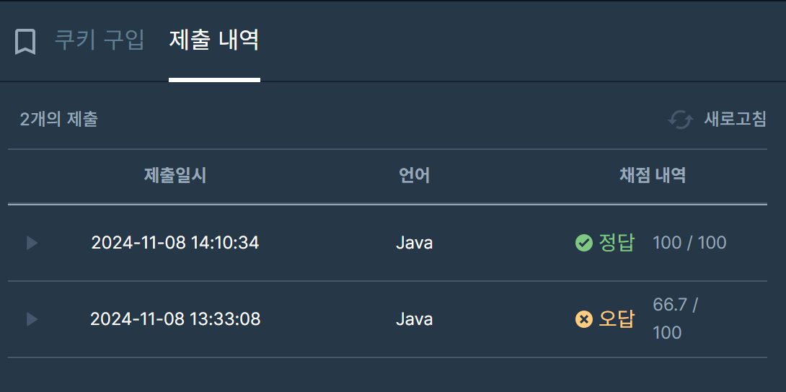

## [프로그래머스 Lv4. 쿠키 구입](https://school.programmers.co.kr/learn/courses/30/lessons/49995?language=java)

> 키워드 유추
- 구간합, 누적합, 투포인터
- 1 <= l <= m, m+1 <= r <= N
- A[l]+..+A[m] = A[m+1]+..+A[r] 를 만족
- 입출력 예제로 문제를 쉽게 유추할 수 있었음

> 접근법
<p> 누적합 1차원 배열 탐색 </p>
<p> 투포인터 활용 </p>
<p> 포인터 이동조건 : m의 위치별로 투포인터 탐색 </p>

> 시간복잡도
<p> O(N^3) </p>
<P> m을 기준O(N) 으로 왼쪽, 오른쪽에서 나올 수 있는 모든 구간합을 탐색 O(N^2)  --> O(N^3)</P>

### 구현 코드
```java
        /**
        키워드 : 구간합, 누적합, 투포인터
        접근법
        누적합 1차원 배열 탐색
        투포인터 활용
        l, m, r
        포인터 이동조건
        m의 위치별로 투포인터 탐색
        if(m == 2)
        
        
        **/
import java.util.*;
class Solution {
    public int solution(int[] cookie) {
        int answer = 0;
        

        int[] sum = new int[cookie.length];
        sum[0] = cookie[0];
        for(int i=1; i<cookie.length; i++) {
            sum[i] = cookie[i] + sum[i-1];
        }
        
        for(int m=0; m<cookie.length-1; m++) {
            for(int l=0; l<=m; l++) {
                int left = sum[m];
                if(l != 0) left -= sum[l-1];
                //left를 만족하는 오른쪽 구간 탐색
                for(int r=m+1; r<cookie.length; r++) {
                    int right = sum[r] - sum[m];
                    if(left == right) {
                        answer = Math.max(answer, left);
                    }
                    else if(left < right) break;
                }
            }
        }
        
        
        return answer;
    }
}
```

> 제출 결과


> 스터디 정리
- 이번 문제는 구간합을 통해 조건 비교 업데이트를 진행하는 문제
- 누적합, 투포인터를 충분히 유추할 수 있었던 점
- 나의 경우 m을 기준으로 탐색은 했지만, 왼쪽 오른쪽의 구간합 탐색을 투포인터가 아닌 완전탐색으로 진행
- 스터디 종료 후 r을 기준으로 포인터 l과 m을 투포인터로 탐색하는 풀이로 Solve
- left < right -> l포인터 증가 (m은 그대로 l만 증가하면 left값은 낮아짐)
- left >= right -> m포인터 증가 (m만 증가할 시 left값이 커짐)

> 구현 알고리즘
<p> 누적합 </p>
<p> 투포인터 </p>

> 풀이 링크

[Private Solve](https://github.com/The-Four-Error-Pickers/Algorithm-Study/tree/main/Private%20Solve/49995.%20%EC%BF%A0%ED%82%A4%20%EA%B5%AC%EC%9E%85/Be-HinD(Ryo))

