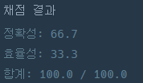

## [프로그래머스 Lv4. 쿠키구입](https://school.programmers.co.kr/learn/courses/30/lessons/49995)

> 문제의 키워드

- 1번부터 N번까지 번호가 차례대로 부여된 바구니 N개가 있음.
- 이를 두 명에게 나눠줘야하는데 바구니 갯수는 상관없고 같은 양의 과자를 줘야함! 즉, 아래의 식을 만족해야함
- A[l]+..+A[m] = A[m+1]+..+A[r]를 만족해야함

<br/>
<br/>

> 접근법 분석
- 처음에 구간합을 빠르게 구하면 된다! 라고 생각하고 구간합을 구하는데 logN의 시간 복잡도를 가지는 세그먼트 트리를 사용
- 하지만 세그먼트로 문제를 풀어보니, <strong> 시간초과가 뜸!! <strong>
- 시간복잡도는 N^2 * log N 인데, 문제 조건을 정확히 모르겠지만,, 빡빡할거라고 예상,  <strong> 그래서 N^2의 시간복잡도를 가지는 투 포인터를 사용하기로 함 </strong>


<br/>

<br/>

> 알고리즘

#### 투 포인터


<br/>

> 시간복잡도

#### O(N^2)

<br/>

### 구현 코드(시간복잡도 초과)

```java
class Solution {
    public int solution(int[] cookie) {
                
        int h = (int) Math.ceil(Math.log(cookie.length + 1) / Math.log(2));
        int[] tree = new int[(int) Math.pow(2, h + 1)];
        init(tree, cookie, 1, 0, cookie.length - 1);

        int answer = 0;
        
        for (int m = 0; m < cookie.length - 1; m++) {
            int leftSum = 0, rightSum = 0;
            int left = m, right = m + 1;

            while (left >= 0 && right < cookie.length) {
                leftSum = sum(tree, 1, 0, cookie.length - 1, left, m);
                rightSum = sum(tree, 1, 0, cookie.length - 1, m + 1, right);

                if (leftSum == rightSum) {
                    answer = Math.max(answer, leftSum);
                }
                if (leftSum <= rightSum) left--;
                else right++;
            }
        }
        
        return answer;
    }
    
    public int init(int[] tree, int[] arr, int temp, int start, int end) { 
        if(start == end) return tree[temp] = arr[start];    // 리프 노드 일때
        return tree[temp] = init(tree, arr, temp * 2, start, (start + end) / 2)
                + init(tree, arr, temp * 2 + 1, (start + end) / 2 + 1, end);
    }
    
    public int sum(int[] tree, int temp, int start, int end, int left, int right) {
        if(left > end || right < start) return 0;
        if((left <= start) && (end <= right)) return tree[temp];

        return sum(tree, temp * 2, start, (start + end) / 2, left, right)
                + sum(tree, temp * 2 + 1, (start + end) / 2 + 1, end, left, right);
    }
}

```

### 제출 결과



#### 풀이 링크

[Private Solve](https://github.com/The-Four-Error-Pickers/Algorithm-Study/tree/main/Private%20Solve/프로그래머스/49995.%20%EC%BF%A0%ED%82%A4%20%EA%B5%AC%EC%9E%85/JunHo/2024-11-12T154733)
