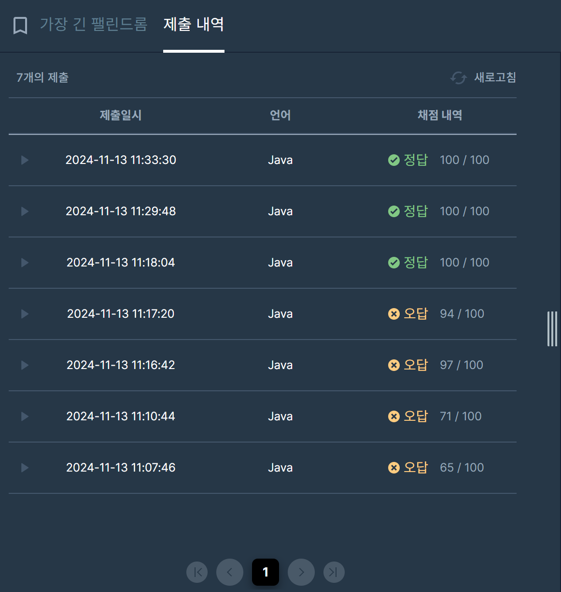

## [프로그래머스 Lv3. 가장 긴 팰린드롬](https://school.programmers.co.kr/learn/courses/30/lessons/12904)

> 키워드 유추
- 문자열 s의 부분문자열
- 가장 긴 팰린드롬의 길이

> 접근법
<p> s = 2,500 || O(N^2) 풀이까지 가능. </p>
<p> 예제를 보고 자리수를 기준으로 탐색 == 홀수개만 탐색가능. </p>
<p> 정답이 짝수개일 경우 탐색이 안됨. ("aaaab") </p>
<p> 그럼 어떻게? == 두개의 연속되는 값이 있다면 l, r을 연속되는 값으로 잡고 탐색 </p>

> 시간복잡도
<p> O(N^2) </p>

### 구현 코드
```java
import java.util.*;
class Solution
{
    public int solution(String s)
    {
        int answer = 1;

        //O(N^2) 풀이까지 가능.
        //예제를 보고 자리수를 기준으로 탐색 == 홀수개만 탐색가능.
        //정답이 짝수개일 경우 탐색이 안됨. ("aaaab")
        //그럼 어떻게? == 두개의 연속되는 값이 있다면 l, r을 연속되는 값으로 잡고 탐색
        
        
        for(int idx=1; idx<s.length(); idx++) {
            if(s.charAt(idx-1) == s.charAt(idx)) {
                //두개의 연속되는 값이 있다면 추가 탐색
                int l = idx-1;
                int r = idx;
                int ans = 0;
                while(l>=0 && r<s.length()) {
                    if(s.charAt(l) == s.charAt(r)) {
                        ans += 2;
                        answer = Math.max(answer, ans);
                    }
                    else break;
                    l--;
                    r++;
                }
            }
            
            int l = idx-1;
            int r = idx+1;
            int ans = 1;
            while(l>=0 && r<s.length()) {
                if(s.charAt(l) == s.charAt(r)) {
                    ans += 2;
                    answer = Math.max(answer, ans);
                }
                else {
                    break;
                }
                l--;
                r++;
            }
        }

        return answer;
    }
}
```

> 제출 결과


> 스터디 정리
- 이번 문제는 유명한 펠린드롬 문제로 부분문자열이라는 키워드가 중요함
- 또한 예제는 홀수개의 정답 뿐이므로 실수하기가 쉬움
- 반례로 짝수개의 정답일 경우에는 중간값을 기준으로 투포인터를 쓰는게 아니라 두개의 값을 기준으로 양쪽으로 탐색해야함

> 구현 알고리즘
<p> 투포인터 </p>

> 풀이 링크

[Private Solve](https://github.com/The-Four-Error-Pickers/Algorithm-Study/tree/main/Private%20Solve/프로그래머스/12904.%20%EA%B0%80%EC%9E%A5%20%EA%B8%B4%20%ED%8C%B0%EB%A6%B0%EB%93%9C%EB%A1%AC/Be-HinD(Ryo)/2024-11-16T1894)

