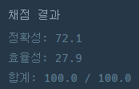

## [프로그래머스 Lv3. 가장 긴 펠린드롬](https://school.programmers.co.kr/learn/courses/30/lessons/12904)

> 문제의 키워드

- 팰린드롬 : 앞뒤를 뒤집어도 똑같은 문자열
- 문자열은 소문자로만 구성

<br/>
<br/>

> 접근법 분석
- 1. 문자열에서 펠린드롬이 가능한 길이수를 탐색한다. (첫번째 반복문)
- 2. 길이로 부터 시작할 수 있는 모든 인덱스 탐색. (두번째 반복문)
- 3. 길이가 짝수든 홀수든 길이/2 만큼만 양끝으로 확인해주면 됨(세번째 반복문)


<br/>

<br/>

> 알고리즘

#### 문자열, 투 포인터


<br/>

> 시간복잡도

#### O(N^3)

<br/>

### 구현 코드

```java
class Solution {
    public int solution(String s) {
        int answer = 1;

        loop : for(int length = s.length(); length > 0; length--) {    // 1. 길이 정하기
            loop2 : for(int idx = 0; idx + length <= s.length(); idx++) {  // 2. 길이로 부터 시작할 수 있는 모든 인덱스 탐색
                for(int i = 0; i < length / 2; i++) {    // 3. 양 끝이 똑같은지 확인
                    if(s.charAt(idx + i) != s.charAt(idx + length - i - 1)) {   // 양 끝이 다르면 다음 인덱스 탐색
                        continue loop2;    
                    }
                }
                
                answer = length;
                break loop;
            }
        }

        return answer;
    }
}

```

### 제출 결과



#### 풀이 링크

[Private Solve](https://github.com/The-Four-Error-Pickers/Algorithm-Study/tree/main/Private%20Solve/프로그래머스/12904.%20%EA%B0%80%EC%9E%A5%20%EA%B8%B4%20%ED%8C%B0%EB%A6%B0%EB%93%9C%EB%A1%AC/JunHo/2024-11-16T115910)
