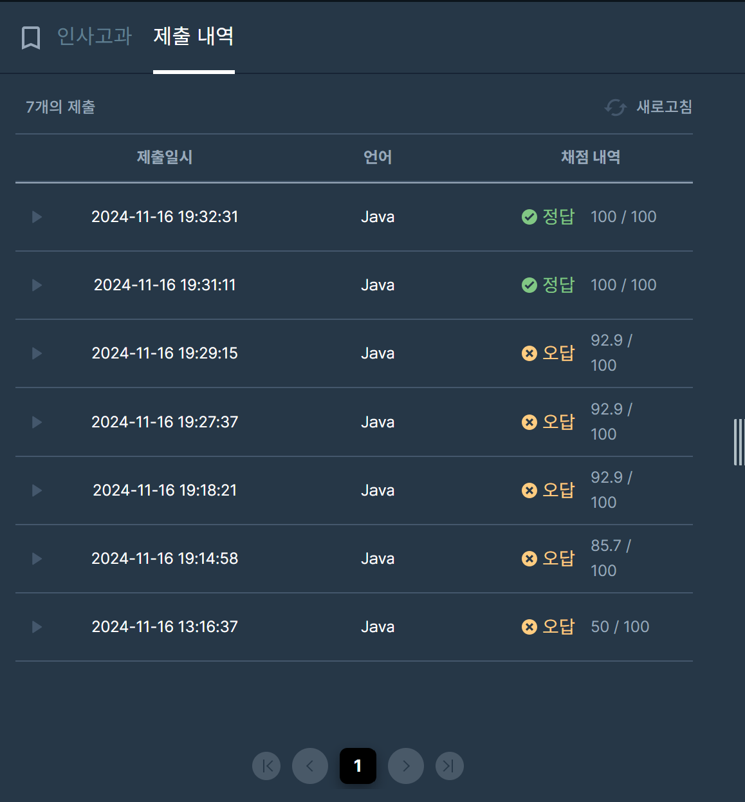

## [프로그래머스 Lv3. 인사고과](https://school.programmers.co.kr/learn/courses/30/lessons/152995)

> 키워드 유추
- 입력으로 각 인원 별 근태 점수, 평가 점수가 들어옴
- 다른 인원보다 각 점수가 낮을 경우 과락
- 동석차가 존재, 동석차의 수만큼 다음 석차는 건너 뜀

> 접근법
<p> scores의 길이는 100,000 즉 O(NlogN)이 최대 </p>
<p> 근태 점수로 내림차순 정렬 </p>
<p> 현재 원소보다 근태 점수가 큰 값들에 대한 평가 점수의 최대값(prevEval)을 기록 </p>
<p> 최대값보다 현재 원소의 평가점수가 낮을 경우 과락 </p>

> 만약 과락되는 원소가 원호의 원소라면 return -1
<p> 과락이 아닌 값들에 대한 합산을 pq에 추가 </p>
<p> 최종 순위를 도출 </p>

<br>

> 시간복잡도
<p> O(NlogN) </p>

> 정렬의 시간복잡도 (Arrays.sort)

### 구현 코드
```java
import java.util.*;
class Solution {
    public int solution(int[][] scores) {
        
        int[] wanho = scores[0];
        
        Arrays.sort(scores, (o1,o2) -> {
            if(o1[0] == o2[0]) return Integer.compare(o2[1], o1[1]);
            return Integer.compare(o2[0], o1[0]);
        });
        
        
        PriorityQueue<Integer> pq = new PriorityQueue<>((o1,o2) -> Integer.compare(o2,o1));
       
        int prevIdx = scores[0][0];
        int prevEval = 0; //prevIdx에 맞는 평가 최대값
        int idx = scores[0][0];
        int eval = scores[0][1];  //평가 점수의 현재 최대값
        pq.offer(prevIdx + eval);
        
        for(int i=1; i<scores.length; i++) {
            int[] cur = scores[i];
            if(prevIdx > cur[0]) {  //낮아지는 시점에 이전 최대값으로 갱신
                if(idx != cur[0]) {
                    prevIdx = idx;
                    prevEval = Math.max(prevEval, eval);
                }
            }
            
            eval = Math.max(eval, cur[1]);
            idx = cur[0];
            
            if(cur[1] < prevEval) {
                //과락
                if(cur[0] == wanho[0] && cur[1] == wanho[1]) return -1;
                continue;
            }
            
            pq.offer(cur[0] + cur[1]);
        }
        
        int rank = 1, pointer = 1;
        int prevRank = Integer.MAX_VALUE;
        while(!pq.isEmpty()) {
            int score = pq.poll();
            if(prevRank > score) {
                rank = pointer;
            }
            if(score == (wanho[0]+wanho[1])) return rank;
            pointer++;
        }
        return -1;
    }
}
```

> 제출 결과


> 스터디 정리
- 이번 문제에서 중요한 점은 과락되는 원소를 찾는 것
- 각 원소를 전부 비교할 경우 O(N^2)으로 시간초과
- 정렬을 통해 현재 원소에 대한 근태점수를 최소값으로 명제 설정
- 탐색을 하면서 현재 원소보다 근태점수가 높은 원소들 중 평가 점수의 최대값을 기록

> 이렇게 탐색할 경우 기록된 평가 점수의 최대값을 통해서 현재 원소의 과락 여부를 알 수 있

> 구현 알고리즘
<p> 정렬 </p>
<p> 그리디 </p>

> 풀이 링크

[Private Solve](https://github.com/The-Four-Error-Pickers/Algorithm-Study/tree/main/Private%20Solve/프로그래머스/152995.%20%EC%9D%B8%EC%82%AC%EA%B3%A0%EA%B3%BC/Be-HinD(Ryo))

