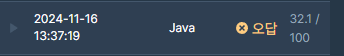

## [프로그래머스 Lv3. 인사고과](https://school.programmers.co.kr/learn/courses/30/lessons/152995)

> 문제의 키워드

- 만약 어떤 사원이 다른 임의의 사원보다 두 점수가 모두 낮은 경우가 한 번이라도 있다면 그 사원은 인센티브를 받지 못함
- 그렇지 않은 사원들에 대해서는 두 점수의 합이 높은 순으로 석차를 내어 석차에 따른 인센티브
- 동석차의 수만큼 다음 석차는 건너 뜁니다. 
- `scores[0]`은 완호의 점수입니다.
- 완호가 인센티브를 받지 못하는 경우 -1을 return

<br/>

> 접근법 분석

- 인센티브 제외 대상자를 걸러내는 기준과, 석차를 매기는 기준이 다름
- 따라서 인센티브를 먼저제외하고, 다른 기준으로 인센티브 대상자의 석차를 매겨야 함을 생각함
- 완호를 기준으로 완호의 석차에 집중하려 하니 계산이 너무 복잡해지기에, 제외 대상자들을 없앤 후의 석차를 매기다가, 완호`[0]`가 없으면 -1 을 리턴하도록 함

- 인센티브 제외 대상자의 조건은 결국 두 점수가 다른 모든 사원들중에 자신보다 높은 사람이 있으면 안된다는 것이 됨
- 이말을 돌려서 생각하면 한쪽 점수가 다른 점수보다 같거나 크다면, 반대쪽 점수는 같거나 작아야한다.
- 두 점수모두 앞서나가게 된다면 그러면 작은 점수를 가진 사원은 인센티브 제외 대상자가 된다.

<br/>

> 구현 접근법

- 인센티브 제외 대상자를 찾기 위해 위의 조건을 생각하면, 결국 정렬을 필요로 한다.
- 별도의 클래스를 통해 완호의 인덱스도 고려하기 위하여 idx, score1, score 2의 객체배열로 정렬 운용을 시도한다.
- 위의 가정은 결국 한쪽 점수를 기준으로 내림차순, 반대쪽을 오름차순하겠다는 것이다. 이렇게 정렬했는데도 불구하고 두 점수 모두 낮은 상황의 사원이 발견되면 해당 사원은 인센티브 제외대상자가 된다.

- 석차 처리에 있어서 정렬자료구조인 우선순위 큐를 사용하고, 동점수에 대해서 개수를 셈하는 방식으로 석차를 매김함

<br/>

> 시간복잡도

#### O(NlogN)

<br/>

### 구현 코드

```java
import java.util.*;

class Solution {
    static class Data {
        int idx;
        int s1;
        int s2;
        
        public Data(int idx, int s1, int s2) {
            this.idx = idx;
            this.s1 = s1;
            this.s2 = s2;
        }
        public String toString() {
            return "[ idx: "+idx+", s1: "+s1+", s2: "+s2+" ]";
        }
    }
    static int n;
    public int solution(int[][] scores) {

        int answer = 0;
        n = scores.length;
        Data[] drr = new Data[n];
        for(int i =0;i<n;i++) {
            drr[i] = new Data(i, scores[i][0], scores[i][1]);
        }

        
        Arrays.sort(drr, (a, b) -> {
           if (a.s1 == b.s1) {
               return a.s2 - b.s2;
           }
            return b.s1 - a.s1;
        });
        
        System.out.println(Arrays.toString(drr));

        PriorityQueue<Data> pq = new PriorityQueue<>((a, b) -> {
            return (b.s1 + b.s2) - (a.s1 + a.s2);
        });
        int minS2 = drr[0].s2;
        pq.add(drr[0]);
        for(int i  = 1;i<drr.length;i++) {
            if (minS2 > drr[i].s2) {
                minS2 = Math.min(drr[i].s2, minS2);
            } else {
                pq.add(drr[i]);
            }
        }
        
        int rank = 0;
        int max = 211111;
        int cnt = 1;
        while(!pq.isEmpty()) {
            Data now = pq.peek();
            int sum = now.s1 + now.s2;
            if (max == sum) {
                cnt++;
            } else if (max > sum) {
                rank += cnt;
                cnt = 1;
                max = sum;
            }
            
            if (now.idx == 0) {
                return rank;
            }
            pq.poll();
            
        }
        return -1;
    }
}
```

### 제출 결과



<br>

# 토론 접근법 풀이

토론 도중, 인센티브 제외 대상자를 찾는데 문제가 있음을 파악함

무조건 한쪽이 다른사람보다 크거나 같으면 다른쪽은 작거나 같아야함

이 상황에서 기준을 잡고 내림차순 및 오름차순을 정렬을 했다면,

오름차순 정렬에서 오름차순을 만족하지 못하는 대상자가 인센티브 제외 대상이 된다.

이를 만족하기 위해서는 기존의 `Math.min`이 아니라 `Math.max`를 사용해야 한다.

### 토론 based 구현 코드

```java
import java.util.*;

class Solution {
    static class Data {
        int idx;
        int s1;
        int s2;
        
        public Data(int idx, int s1, int s2) {
            this.idx = idx;
            this.s1 = s1;
            this.s2 = s2;
        }
        public String toString() {
            return "[ idx: "+idx+", s1: "+s1+", s2: "+s2+" ]";
        }
    }
    static int n;
    public int solution(int[][] scores) {

        int answer = 0;
        n = scores.length;
        Data[] drr = new Data[n];
        for(int i =0;i<n;i++) {
            drr[i] = new Data(i, scores[i][0], scores[i][1]);
        }

        
        Arrays.sort(drr, (a, b) -> {
           if (a.s1 == b.s1) {
               return a.s2 - b.s2;
           }
            return b.s1 - a.s1;
        });
        
        PriorityQueue<Data> pq = new PriorityQueue<>((a, b) -> {
            return (b.s1 + b.s2) - (a.s1 + a.s2);
        });
        int minS2 = drr[0].s2;
        pq.add(drr[0]);
        for(int i  = 1;i<drr.length;i++) {
            if (minS2 > drr[i].s2) {
                continue;
            } else {
                // 하나라도 작아지면 안됨.
                minS2 = Math.max(drr[i].s2, minS2);
                pq.add(drr[i]);
            }
        }
        int rank = 0;
        int max = 211111;
        int cnt = 1;
        while(!pq.isEmpty()) {
            Data now = pq.peek();
            int sum = now.s1 + now.s2;
            if (max == sum) {
                cnt++;
            } else if (max > sum) {
                rank += cnt;
                cnt = 1;
                max = sum;
            }
            
            if (now.idx == 0) {
                return rank;
            }
            pq.poll();
            
        }
        return -1;
    }
}
```

### 토론 based 제출 결과


#### 풀이 링크

[Private Solve](https://github.com/The-Four-Error-Pickers/Algorithm-Study/tree/main/Private%20Solve/152995.%20%EC%9D%B8%EC%82%AC%EA%B3%A0%EA%B3%BC/HaeChang/2024-11-16T13556)
