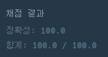

## [프로그래머스 Lv3. 인사고과](https://school.programmers.co.kr/learn/courses/30/lessons/152995)

> 문제의 키워드

- 근무 태도점수, 동료 평가 점수의 합으로 순위를 계산해라
- 다른 임의의 사원보다 두 점수 각각이 모두 낮은 경우가 한번이라도 있으면 순위에서 제외

<br/>
<br/>

> 접근법 분석
- n이 10만이라서 nlogn정도로 해결해야 한다고 생각
- 처음에는 점수의 합을 기준으로 정렬할려고 했는데 그럼 키워드 2번을 제외하기 어렵다고 생각
- 그래서 우선 근태점수를 내림차순으로 정렬, 그리고 동료 평가 점수로 오름차순으로 정렬을 함
- 그러면 이제 동료평가점수의 누적 최댓값을 계산하며 제외할 친구를 제외함
- 또한, 완호보다 점수가 낮은 얘들은 제외
- 이렇게 나가면서 완호보다 점수가 크거나 같은 사원들을 pq에 저장함
- 랭크 계산

<br/>
<br/>

> 알고리즘

#### 정렬


<br/>

> 시간복잡도

#### O(NlogN)

<br/>

### 구현 코드

```java
import java.util.*;

class Solution {
    public int solution(int[][] scores) {
        
        int[] wanho = scores[0];  // 원호 점수 저장
        
        Arrays.sort(scores, (o1, o2) -> {
            if(o1[0] == o2[0])  return Integer.compare(o2[1], o1[1]);
            else return Integer.compare(o2[0], o1[0]);
        });
        
        int score1Max = Integer.MIN_VALUE;   // 동료 평가 점수가 최댓값일때의 근태점수
        int score2Max = Integer.MIN_VALUE;  // 동료 평가 점수의 최댓값
        PriorityQueue<Integer> pq = new PriorityQueue<>(Collections.reverseOrder());
        
        for(int[] arr : scores) {
            int tempScore = arr[0] + arr[1];
            
            if(tempScore < (wanho[0] + wanho[1])) continue; // 완호보다 점수 작은 사원 제외
            
            if(arr[1] > score2Max) {
                score2Max = arr[1];
                score1Max = arr[0];
            }    
            
            if((arr[0] != score1Max) && (score2Max > arr[1])) {
                if((arr[0] == wanho[0]) && (arr[1] == wanho[1])) return -1; // 원호면
                continue; // 근태점수가 최댓값이 아니면서 동료 평가점수가 현재 최댓값보다 작다면 제외
            }
                
            pq.offer(tempScore);
        }
        
        int rank = 0;  
        while(!pq.isEmpty()) {
            int score = pq.poll();
            if(score == (wanho[0] + wanho[1])) break;
            rank++;
        }
        
        return rank + 1;
    }
}

```

### 제출 결과



#### 풀이 링크

[Private Solve](https://github.com/The-Four-Error-Pickers/Algorithm-Study/tree/main/Private%20Solve/프로그래머스/152995.%20%EC%9D%B8%EC%82%AC%EA%B3%A0%EA%B3%BC/JunHo/2024-11-16T15263)
