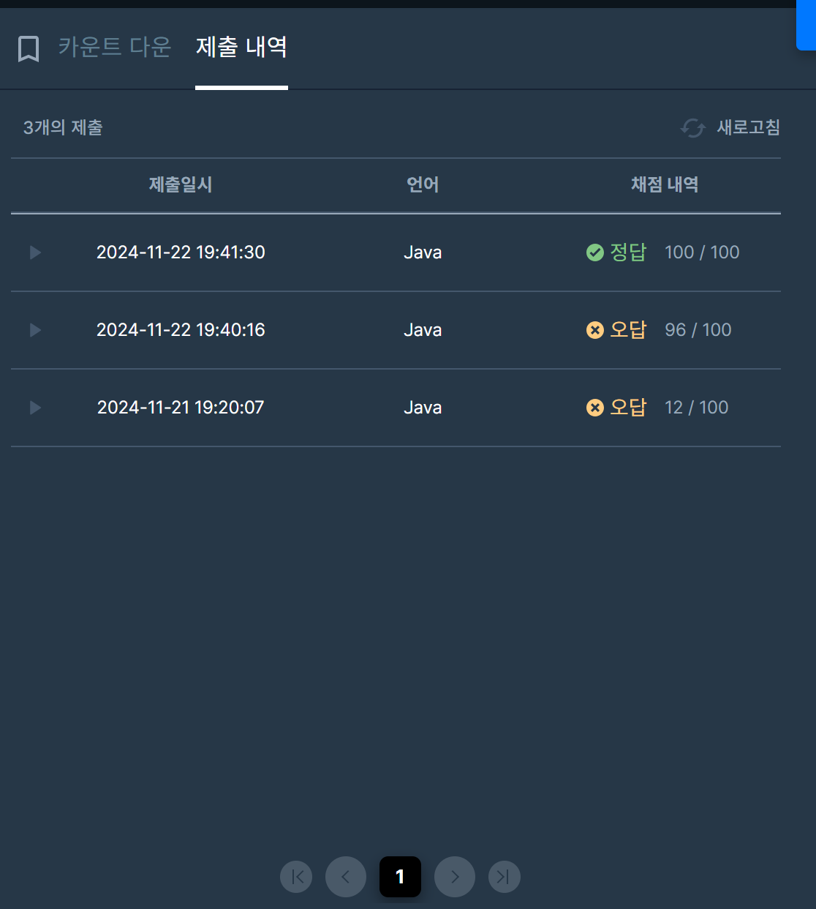

## [프로그래머스 Lv3. 카운트 다운](https://school.programmers.co.kr/learn/courses/30/lessons/131129)

> 키워드 유추

- 최소한의 다트로 0점을 만드는 게 가장 중요
- 그러한 방법이 여러가지가 있다면 "싱글" 또는 "불"을 최대한 많이 던지는 방법

> 접근법
- target의 길이 100,000 -> O(N)까지 가능
- 받을 수 있는 점수의 종류는 정해져있음.
- 처음 target점수에서 bfs탐색을 통해 0에 도달하는 가짓수 중 최적해를 탐색
- PQ를 통해 같은 횟수에 대해서는 싱글,불 카운트 내림차순으로 추출함으로써 첫 도달 결과가 최적해임을 보장

<br/>

> 시간 복잡도

#### O(N)

점수의 최대값 : N

<br/>

### 구현 코드

```java
/**
키워드
최소한의 다트로 0점을 만드는 게 가장 중요
그러한 방법이 여러가지가 있다면 "싱글" 또는 "불"을 최대한 많이 던지는 방법

접근법
받을 수 있는 점수의 종류는 정해져있음.
처음 target점수에서 bfs탐색을 통해 0에 도달하는 가짓수 중 최적해를 탐색
PQ를 통해 같은 횟수에 대해서는 싱글,불 카운트 내림차순으로 추출
**/

import java.util.*;
class Solution {
    static class DART implements Comparable<DART> {
        int score;
        int cnt;
        int spCnt;
        public DART(int score, int cnt, int spCnt) {
            this.score = score;
            this.cnt = cnt;
            this.spCnt = spCnt;
        }
        @Override
        public int compareTo(DART o) {
            if(this.cnt == o.cnt) {
                return o.spCnt - this.spCnt;
            }
            return this.cnt - o.cnt;
        }
    }
    
    static List<Integer> list;
    public int[] solution(int target) {

        Set<Integer> set = new TreeSet<>((o1,o2) -> o2 - o1);
        for(int i=1; i<=20; i++) {
            set.add(i);
            set.add(i*2);
            set.add(i*3);
        }
        
        list = new ArrayList<>();
        for(int idx : set) {
            list.add(idx);
        }
        
        DART res = bfs(target);
        
        return new int[]{res.cnt, res.spCnt};
    }
    
    
    static DART bfs(int start) {
        Queue<DART> pq = new ArrayDeque<>();
        pq.offer(new DART(start, 0, 0));
        boolean[] v = new boolean[start+1];
        v[start] = true;
        
        //그리디 사고
        //50보다 크면 50위의 수들만 이용해서 줄여나가기.
        while(!pq.isEmpty()) {
            DART cur = pq.poll();
            
            if(cur.score == 0) return cur;
            
            if(cur.score - 50 >= 0 && !v[cur.score-50]) {
                pq.offer(new DART(cur.score-50, cur.cnt+1, cur.spCnt+1)); //불
                v[cur.score-50] = true;
            }
            
            for(int idx : list) {
                int next = cur.score - idx;
                if(next < 0) continue;
                if(v[next]) continue;
                if(idx <= 20) {
                    pq.offer(new DART(next, cur.cnt+1, cur.spCnt+1));
                }
                else {
                    pq.offer(new DART(next, cur.cnt+1, cur.spCnt));
                }
                    v[next] = true;
                
            }
        }
        return new DART(-1,-1,-1);
    }
}
```

> 제출 결과

> 

> 스터디 정리
- 최근에 느끼는거지만 단순한 문제를 너무 어렵게 접근하는 경향이 있다고 느꼈음.
- 해당 문제를 통해 탐색과정에서 임의 score에 대해서 방문체크를 하면 탐색이 안되는 경우가 있는지 애매하다고 생각하여 BFS 생각을 못함.
- 또한 풀이과정에서 위 생각으로 인해 다익스트라 최소값 배열을 활용하려 했지만 메모리초과
- 또한 이너 클래스명에 대한 언급이 나왔는데 개인적으로 알고리즘 풀이는 대문자를 통해서 가독성을 올리는게 좋다고 생각함.
- 왜 방문체크를 해도 같은 점수 x에 대해서 경우의 수 탐색이 안되도 되는지에 대해 추가적인 생각을 해보면 좋을 것 같음.


> 구현 알고리즘
<p> BFS + PQ </p>

> 풀이 링크

[Private Solve](https://github.com/The-Four-Error-Pickers/Algorithm-Study/tree/main/Private%20Solve/131129.%20%EC%B9%B4%EC%9A%B4%ED%8A%B8%20%EB%8B%A4%EC%9A%B4/Be-HinD(Ryo))
