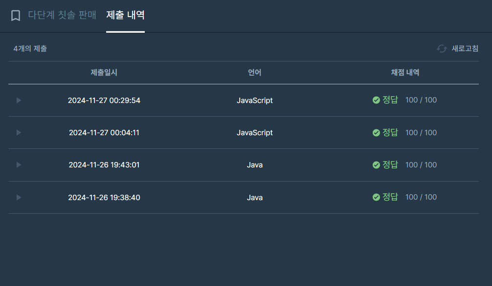

## [프로그래머스 Lv3. 다단계 칫솔 판매](https://school.programmers.co.kr/learn/courses/30/lessons/77486)

> 키워드 유추
- 자신이 조직에 추천하여 가입시킨 판매원에게서 발생하는 이익의 10% 까지 자신에 이익
- 원 단위에서 절사하며
- 10%를 계산한 금액이 1 원 미만인 경우에는 이득을 분배하지 않고 자신이 모두 가집니다.
- 칫솔의 판매에서 발생하는 이익은 개당 100 원

> 접근법
- enroll <= 10,000 || seller <= 100,000 => O(seller)인줄 알았으나 쿼리당 업데이트 카운트가 10회 미만인 점 간과
- HashMap을 통해 노드당 부모에 대한 정보 기록
- seller쿼리를 수행하며 10% 절사 연산 수행 및 Map 부모 탐색을 통한 갱신 (최대 10회 미만 갱신)
- 금액에 대해서도 노드당 HashMap을 통해 기록

<br/>

> 시간 복잡도

#### O(N)

seller의 최대 길이 당 10회 미만의 연산

<br/>

### 구현 코드

```java
import java.util.*;
class Solution {
    public int[] solution(String[] enroll, String[] referral, String[] seller, int[] amount) {
        
        Map<String, String> parent = new HashMap<>();
        Map<String, Integer> res = new HashMap<>();
        for(int i=0; i<enroll.length; i++) {
            parent.put(enroll[i], referral[i]); //판매원의 부모를 기록
            res.put(enroll[i], 0);
        }
        
    
        for(int i=0; i<seller.length; i++) {
            String cur = seller[i];
            int price = amount[i] * 100;
            while(true) {
                if(cur.equals("-")) break;
                
                int remain = (int) (price * 0.1);
                if(remain == 0) {
                    res.put(cur, res.get(cur) + price);
                    break;
                }
                else { //10프로 이월이 된다면
                    res.put(cur, res.get(cur) + (price-remain));
                    price = remain;
                    cur = parent.get(cur);
                }
            }
        }
        
        int[] ans = new int[enroll.length];
        for(int i=0; i<enroll.length; i++) {
            ans[i] = res.get(enroll[i]);
        }
        
        return ans;
    }
}
```

> 제출 결과

> 

> 스터디 정리
- 문제를 꼼꼼이 읽지 않거나 조건을 잘 확인하지 못하면 이번처럼 시간복잡도 계산을 잘 못할 수 있다.
- HashMap을 통해서 부모 관계를 기록하고 참조 및 탐색을 진행했지만 인접리스트 또는 참조 객체로 하는게 더 효율적이였음
- 트리 자료구조지만 부모의 정보만 알고 있으면 되는 문제였음


> 구현 알고리즘
<p> 해시 + 구현 </p>

> 풀이 링크

[Private Solve](https://github.com/The-Four-Error-Pickers/Algorithm-Study/tree/main/Private%20Solve/77486.%20%EB%8B%A4%EB%8B%A8%EA%B3%84%20%EC%B9%AB%EC%86%94%20%ED%8C%90%EB%A7%A4/Be-HinD(Ryo))
