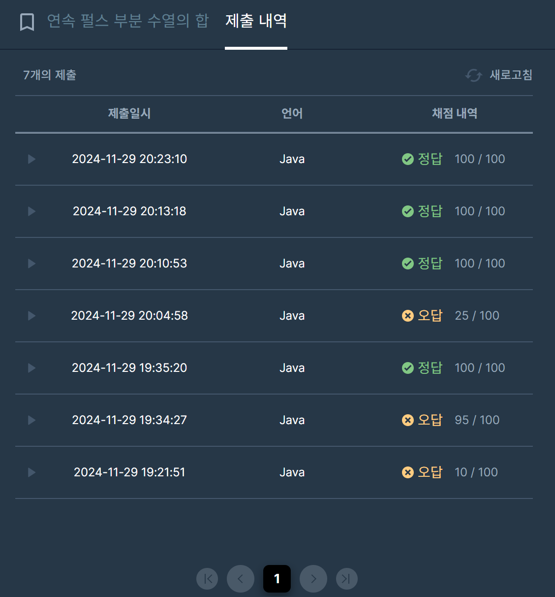

## [프로그래머스 Lv3. 연속 펄스 부분 수열의 합](https://school.programmers.co.kr/learn/courses/30/lessons/161988)

> 키워드 유추
- 1 또는 -1로 시작하면서 1과 -1이 번갈아 나오는 수열
- 정수 수열 sequence가 매개변수
- 연속 펄스 부분 수열의 합 중 가장 큰 것

> 접근법
- 펄스 수열이 적용된 전체 배열의 누적합을 이용
- 시작은 -1 혹은 +1 두가지에 대해 각각 적용
- 최대값을 기록하면서 누적합을 계산
- 최대값에서부터 이전해를 계산하면서 갱신

<br/>

> 시간 복잡도

#### O(N)

전체 N에 대한 누적합 계산

<br/>

### 구현 코드

```java
import java.util.*;
class Solution {
    public long solution(int[] sequence) {

        int n = sequence.length;
        
        //누적합 연산 + 최대 구간 탐색 및 인덱스 저장
        long[] plusSum = new long[n];
        long[] minusSum = new long[n];
        plusSum[0] = sequence[0]; minusSum[0] = sequence[0] * -1;
        long plusMax = plusSum[0], minusMax = minusSum[0];
        int pIdx = 0, mIdx = 0;
        
        for(int i=1; i<n; i++) {
            if(i%2 == 0) {
                plusSum[i] = sequence[i] + plusSum[i-1];
                minusSum[i] = (sequence[i] * -1) + minusSum[i-1];
            }
            else {
                plusSum[i] = (sequence[i] * -1) + plusSum[i-1];
                minusSum[i] = sequence[i] + minusSum[i-1];
            }
            if(plusSum[i] > plusMax) {
                plusMax = plusSum[i];
                pIdx = i;
            }
            if(minusSum[i] > minusMax) {
                minusMax = minusSum[i];
                mIdx = i;
            }
        }
    
        
        //최대값에서부터 구간합 탐색
        long plusRes = plusSum[pIdx], minusRes = minusSum[mIdx];
        for(int i=pIdx-1; i>=0; i--) {
            plusRes = Math.max(plusRes, plusSum[pIdx] - plusSum[i]);
        }
        
        for(int i=mIdx-1; i>=0; i--) {
            minusRes = Math.max(minusRes, minusSum[mIdx] - minusSum[i]);
        }
        
        return Math.max(plusRes, minusRes);
    }
}
```

> 제출 결과

> 

> 스터디 정리
- 처음에 펄스수열의 값을 미리 계산해놓는 접근은 했음
- 투포인터로 접근하여 구간합을 탐색했지만 실패
- 미리 전처리 + 구간합이라는 키워드를 누적합으로 접근하여 풀이


> 구현 알고리즘
<p> 누적합 </p>

> 풀이 링크

[Private Solve](https://github.com/The-Four-Error-Pickers/Algorithm-Study/tree/main/Private%20Solve/161988.%20%EC%97%B0%EC%86%8D%20%ED%8E%84%EC%8A%A4%20%EB%B6%80%EB%B6%84%20%EC%88%98%EC%97%B4%EC%9D%98%20%ED%95%A9/Be-HinD(Ryo))
