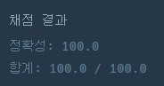

## [프로그래머스 Lv4. 쿠키구입](https://school.programmers.co.kr/learn/courses/30/lessons/49995)

> 문제의 키워드

- 1번부터 N번까지 차례로 번호가 붙어있는 바구니 N개
- 두 아들에게 동일한 수의 과자를 나눠 주어야 하며, `l ~ m번, m + 1 ~ r번` 으로 나눠줘야함
- 그러한 조건을 만족하는 과자의 최댓값


<br/>

> 접근법 분석

- 두 아들에게 동일한 연속된 구간을 나눠줘야 한다고 파악함
- 연속된 구간임을 만족하여야 하기에, 누적합을 전처리해놓는것이 유리하다고 판단함.
- 또한 cookie 배열의 길이가 2000 밖에 안되기에, 2중 반복까지 된다고 가정할 수 있음
    - 그렇게 가정한다면 매순간 제한된 길이내에 조건을 만족하는 연속된 구간이 존재하는지 찾으면 됨

<br/>

> 두 포인터 접근법

- 우선 연속된 구간합을 빠르게 계산하도록 누적합을 구해놓는다.
    - 구한 누적합 변수명을 `S`라고 가정했을 때 에서,  배열내에 idx1 ~ idx2까지의 합은 (`idx는 단 1부터 시작한다`) `S[idx2 + 1] - S[idx1]` 이 된다.

- R을 하나의 제한된 길이로서 변수로 두고, R을 증가하면서 다음을 수행한다.
    - 제한된 0 ~ R 사이에서 두 포인터를 수행하는데, `l을 0`, `m을 l + 1` 로 놓는다.
    - 현재 `m ~ l`의 합은 `S[m] - S[l]`이고, `m + 1 ~ r`의 합은 `S[r] - S[m]` 으로 정의되고, 이들의 합이 같다면 최대값 갱신대상인지 체크한다.
    - 만약 `m ~ l` 이 더 크다고하면 `l`을 올림으로서 `S[m] - S[l]`구간의 가격을 줄인다.
    - 만약 `r ~ m + 1` 이 더 크다고 하면, `m`을 올림으로서 `S[m] - S[l]`구간의 가격을 높인다.

<br/>

> 구현 접근법

- 누적합을 위에서 말한 점화식으로 정의한다
- 바깥 for 문을 통해 `r의 제한을 2부터` 늘리도록 한다.
    - 3부터 하면 안되는 이유, 쿠키배열의 길이가 2일때 반례를 맞게 된다. `그 이유는 m + 1 이 r 과 같을 수 있기 때문`이다.
- for문 안쪽에서 제한된 r번까지 내에 두 포인터를 활용하여 l과 m을 조정한다.

<br/>

> 시간복잡도

#### O(N^2)

<br/>

### 구현 코드

```java
import java.util.*;

class Solution {
    static int n;
    public int solution(int[] cookie) {
        int answer = 0;
        n = cookie.length;
        int[] S = new int[n + 1];
        for(int i = 1;i<n + 1;i++) {
            S[i] = S[i - 1] + cookie[i - 1];
        }
        
        
        for(int r = 2;r < n + 1; r++) {
            int l = 0;
            int m = l + 1;
            while(l < m) {
                int c1 = S[m] - S[l];
                int c2 = S[r] - S[m];
                if(c1 == c2) {
                    answer = Math.max(answer, c1);
                }
                if (c1 >= c2) {
                    l++;
                } else {
                    m++;
                }
            }
        }
    
        return answer;
    }
}
```

### 제출 결과



<br>

# 토론 접근법 풀이

<p>두 포인터가 떠오름</p>

#### 풀이 링크

[Private Solve](https://github.com/The-Four-Error-Pickers/Algorithm-Study/blob/main/Private%20Solve/49995.%20%EC%BF%A0%ED%82%A4%20%EA%B5%AC%EC%9E%85/HaeChang/2024-11-8T104454/Solution.java)
