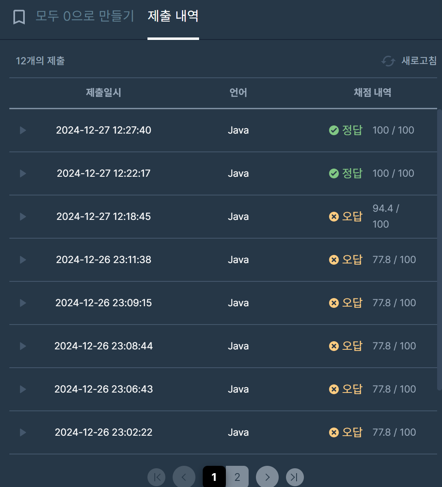

## [프로그래머스 Lv3. 모두 0으로 만들기](https://school.programmers.co.kr/learn/courses/30/lessons/76503)

> 키워드 유추
- 가중치가 부여된 트리
- 모든 점들의 가중치를 0으로

> 접근법
- 정점 <= 300,000 //완전탐색으로는 불가능
- 음수 가중치 가능
- 간선 = 정점-1개
- 전처리 : a의 모든 가중치가 0인지 확인 후 판별
- 리프(혹은 루트)에서부터 0으로 만들기 <<

<br/>

> 시간 복잡도

#### O(N)

정점 개수만큼 dfs 호출

<br/>

### 구현 코드

```java
/**
키워드
가중치가 부여된 트리
모든 점들의 가중치를 0으로

접근법
정점 <= 300,000 //완전탐색으로는 불가능
음수 가중치 가능
간선 = 정점-1개
전처리 : a의 모든 가중치가 0인지 확인 후 판별
리프(혹은 루트)에서부터 0으로 만들기 <<
**/

import java.util.*;
class Solution {
    static List<Integer>[] list;
    static long[] value;
    static long res;
    static boolean[] v;
    public long solution(int[] a, int[][] edges) {
        
        //제로섬 전처리
        value = new long[a.length];
        
        int sum = 0;
        list = new ArrayList[a.length];
        
        for(int i=0; i<a.length; i++) {
            value[i] = a[i];
            sum += a[i];
            list[i] = new ArrayList<Integer>();
        }
        if(sum != 0) return -1;
        
        for(int i=0; i<edges.length; i++) {
            list[edges[i][0]].add(edges[i][1]);
	    	list[edges[i][1]].add(edges[i][0]);
        }
        
        v = new boolean[a.length];
        
        makeZero(0);

        if(value[0] != 0) return -1;
        return res;
    }
    
    static long makeZero(int node) {
        v[node] = true;
        for(int i=0; i<list[node].size(); i++){
            int next = list[node].get(i);
            if(v[next]) continue;
            value[node] += makeZero(next); 
        }
        
        long num = value[node];
        res += Math.abs(num);
        return num;
    }
}
```

> 제출 결과

> 

> 스터디 정리
- 처음엔 트리의 구조를 만들었지만 dfs 사용 시 필요가 없음.
- 되게 빡빡한 테스트케이스 때문에 dfs 사용 시 런타임 에러가 발생하는데, 방문체크를 활용함과 동시에 인접리스트 또한 배열로 바꿈으로써 해결함.
- 또한 방문체크를 통해서 양방향 간선이여도 리프노드에 대한 체크를 할 수 있었음.


> 구현 알고리즘
<p> DFS </p>

> 풀이 링크

[Private Solve](https://github.com/The-Four-Error-Pickers/Algorithm-Study/tree/main/Private%20Solve/76503.%20%EB%AA%A8%EB%91%90%200%EC%9C%BC%EB%A1%9C%20%EB%A7%8C%EB%93%A4%EA%B8%B0/Be-HinD(Ryo))
