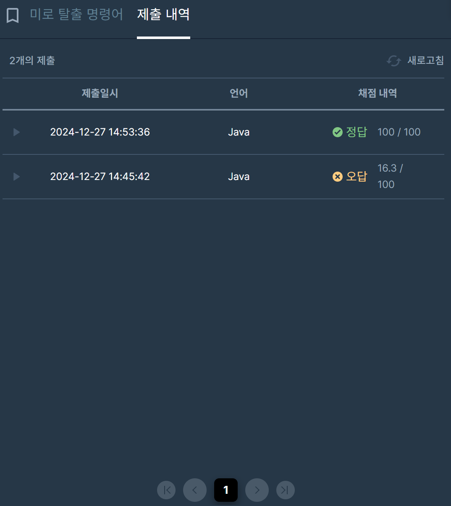

## [프로그래머스 Lv3. 미로 탈출 명령어](https://school.programmers.co.kr/learn/courses/30/lessons/150365)

> 키워드 유추
- (x, y)에서 출발해 (r, c)로 이동해서 탈출
-  이동하는 거리가 총 k
-  같은 격자를 두 번 이상 방문해도 됨
-  문자열이 사전 순으로 가장 빠른 경로로 탈출

> 접근법
- 사전순으로 방문할 수 있도록 방향벡터 구성
- 3차원 방문배열로 이동거리에 따른 방문체크
- k 도달 및 목적지 도착 시 결과값 사전순 비교 및 갱신

<br/>

> 시간 복잡도

#### O(N^2)

인접행렬 BFS

<br/>

### 구현 코드

```java
import java.util.*;
class Solution {
    static class Node {
        int x;
        int y;
        int cnt;
        StringBuilder sb;
        public Node(int x, int y, int cnt, StringBuilder sb) {
            this.x = x;
            this.y = y;
            this.cnt = cnt;
            this.sb = sb;
        }
    }
    static int max;
    static String res;
    public String solution(int n, int m, int x, int y, int r, int c, int k) {
        res = "z";
        max = k;        
        bfs(n,m,x-1,y-1,r-1,c-1);
        return res.equals("z") ? "impossible" : res;
    }
    
    static int[] dx = new int[]{1,0,0,-1};
    static int[] dy = new int[]{0,-1,1,0};
    static char[] arr = new char[]{'d','l','r','u'}; //사전순으로 먼저 방문할 수 있도록
    static void bfs(int n, int m, int x, int y, int r, int c) {
        Queue<Node> q = new ArrayDeque<>();
        q.offer(new Node(x,y,0,new StringBuilder()));
        boolean[][][] v = new boolean[n][m][2501]; //경로횟수에 따른 방문체크 : 같은 위치라도 사전순으로 먼저 방문
        v[x][y][0] = true;
        while(!q.isEmpty()) {
            Node cur = q.poll();
            
            if(cur.cnt > max) continue;
            if(cur.cnt == max) {
                if(cur.x == r && cur.y == c) {
                    // 결과값 갱신
                    if(res.compareTo(cur.sb.toString()) > 0) {
                        res = cur.sb.toString();
                    }
                }
                continue;
            }
            
            for(int i=0; i<4; i++) {
                int nx = cur.x + dx[i];
                int ny = cur.y + dy[i];
                if(nx<0 || ny<0 || nx>=n || ny>=m || v[nx][ny][cur.cnt+1]) continue;
                v[nx][ny][cur.cnt+1] = true;
                StringBuilder next = new StringBuilder(cur.sb);
                next.append(arr[i]);
                q.offer(new Node(nx,ny,cur.cnt+1,next));
            }
        }
    }
}
```

> 제출 결과

> 

> 스터디 정리
- 나의 경우 BFS 혹은 DFS 문제를 풀이할 때 완전탐색 풀이에서 수정해나가며 푸는 스타일.
- 그러나 이번 문제의 경우 도중에 코드를 날려버렸고 다시 짜느라 완탐이상의 생각을 못했음.
- 방문체크를 하기 까다로운 문제였고, 보통 이런 문제들은 방향에 대해서 방문체크를 하지만
- 사전순이라는 조건 때문에 이동거리에 따라 사전순으로 먼저 방문하면 그 다음은 방문할 필요성이 없다는 걸 확인 후 풀이함.
- 결과적으로 DFS 깊이탐색 및 목적지와 현재 거리에 따른 전처리를 추가한 풀이가 훨씬 빠르다는 것을 확인.


> 구현 알고리즘
<p> BFS </p>

> 풀이 링크

[Private Solve](https://github.com/The-Four-Error-Pickers/Algorithm-Study/tree/main/Private%20Solve/프로그래머스/150365.%20%EB%AF%B8%EB%A1%9C%20%ED%83%88%EC%B6%9C%20%EB%AA%85%EB%A0%B9%EC%96%B4/Be-HinD(Ryo))
