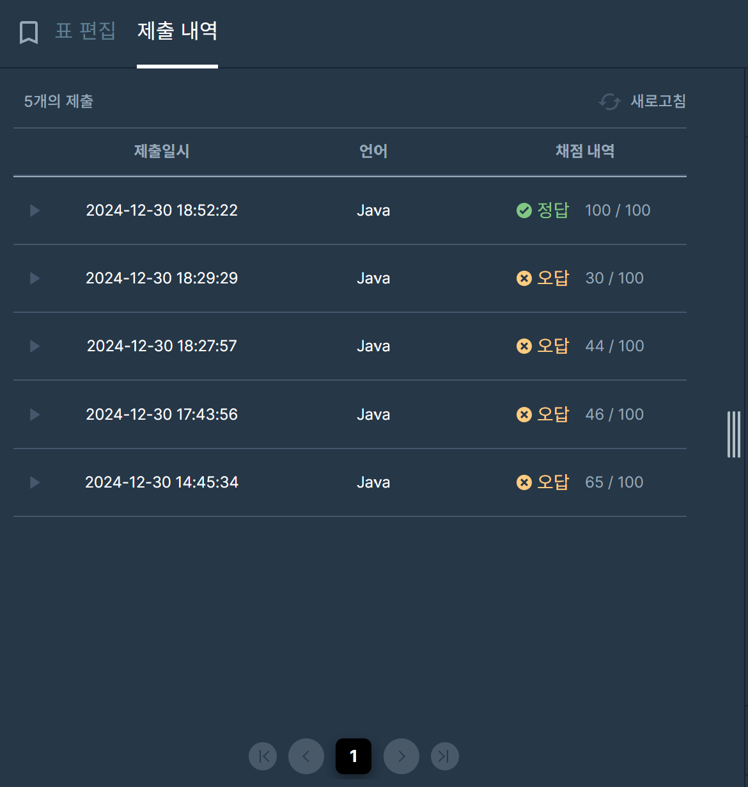

## [프로그래머스 Lv3. 표 편집](https://school.programmers.co.kr/learn/courses/30/lessons/81303)

> 키워드 유추
- 삭제된 행 기록(순서에 맞게) + 인덱스도 갱신
- 현재 선택된 행 갱신
- 복구는 삭제되었던 인덱스 그대로 복구
- 결과값 : 삭제된 행 x , 삭제되지 않은 행 o

> 접근법
- 연결리스트를 직접 구현
- 현재 노드 갱신은 연결리스트 next, prev를 통해 이동
- 삭제, 복구의 경우 Stack활용
- 삭제, 복구 시 이전, 다음 노드의 연결정보 갱신

<br/>

> 시간 복잡도

#### O(N + M)

명령어의 개수 N + 이동 연산 M

<br/>

### 구현 코드

```java
import java.util.*;

class Solution {
    static class Node {
        Node prev, next;
        int idx;

        Node(int idx) {
            this.idx = idx;
        }
    }

    public String solution(int n, int k, String[] cmd) {
        Node[] nodes = new Node[n];
        for (int i = 0; i < n; i++) {
            nodes[i] = new Node(i);
            if (i > 0) {
                nodes[i].prev = nodes[i - 1];
                nodes[i - 1].next = nodes[i];
            }
        }

        Node current = nodes[k];
        Stack<Node> deleted = new Stack<>();

        for (String c : cmd) {
            char operation = c.charAt(0);

            if (operation == 'D') {
                int x = Integer.parseInt(c.substring(2));
                while (x-- > 0) current = current.next;
            } else if (operation == 'U') {
                int x = Integer.parseInt(c.substring(2));
                while (x-- > 0) current = current.prev;
            } else if (operation == 'C') {
                deleted.push(current);
                if (current.prev != null) current.prev.next = current.next;
                if (current.next != null) current.next.prev = current.prev;
                current = (current.next != null) ? current.next : current.prev;
            } else if (operation == 'Z') {
                Node node = deleted.pop();
                if (node.prev != null) node.prev.next = node;
                if (node.next != null) node.next.prev = node;
            }
        }

        StringBuilder result = new StringBuilder("O".repeat(n));
        while (!deleted.isEmpty()) {
            result.setCharAt(deleted.pop().idx, 'X');
        }

        return result.toString();
    }
}
```

> 제출 결과

> 

> 스터디 정리
- 최초 풀이는 컬렉션 프레임워크의 LinkedList를 통해 구현했지만 시간초과 발생
- 위 코드는 생성형 AI를 기반으로 수정된 버전 (-> 연결리스트 직접 구현)
- 최근 스터디를 하면서 느낀점은 자료구조에 약하다는 것.
- 또한 일반적인 시간복잡도 이외에 시간복잡도 계산이 안된다는 것 또한 알게됨.
- 혼자 개인풀이를 할때도 접근과 시간복잡도에 계산을 확실히 하고, 내 생각을 정리 후에 코드로 쓰는 법을 더 연습해야할 것 같음.


> 구현 알고리즘
<p> 자료구조, 구현 </p>

> 풀이 링크

[Private Solve](https://github.com/The-Four-Error-Pickers/Algorithm-Study/tree/main/Private%20Solve/프로그래머스/81303.%20%ED%91%9C%20%ED%8E%B8%EC%A7%91/Be-HinD(Ryo))
