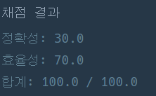

## [프로그래머스 Lv3. 표 편집](https://school.programmers.co.kr/learn/courses/30/lessons/81303)

> 문제의 키워드

- 표의 범위를 벗어나는 입력은 주어지지 않음
- 복구할 행이 없을때 Z가 주어지는 경우는 없음
- U와 D에 대한 X의 합의 최대 : 1,000,000

<br/>


> 접근법 분석
- 최근 삭제된 것부터 복구되기때문에 stack으로 삭제된 Node를 관리
- 나머지는 이중연결리스트와 현재 노드를 가리키는 포인터를 통해 해결
- 추가로 이중연결리스트의 기본은 원하는 노드 삭제할때 까지 탐색을 해야하는데, 배열과 함께 사용하면 인덱스를 통한 탐색, 삽입, 삭제에 관한 효율성을 증가시킬 수 있음!!

> 알고리즘

#### 연결리스트


<br/>

> 시간복잡도
#### O(X)

<br/>

### 구현 코드

```java
import java.util.*;

class Solution {
    
    static class Node {
        Node prev;  // 이전 노드를 가리키는 변수
        Node next;  // 다음 노드를 가리키는 변수
        boolean removed;    // 삭제됐는지 확인하는 변수, 이후 result에 사용하기 위함
        
        Node(Node prev, Node next, boolean removed) {
            this.prev = prev;
            this.next = next;
            this.removed = removed;
        }
        
        Node up(int count) {    // 포인터 위로 이동
            Node current = this;
            for(int i = 0; i < count; i++) current = current.prev;
            return current;
        }
        
        Node down(int count) {  // 포인터 아래로 이동
            Node current = this;
            for(int i = 0; i < count; i++) current = current.next;
            return current;
        }
        
        Node delete() { // 행 삭제
            Node current = this;
            this.removed = true;
            if(current.prev != null) current.prev.next = current.next;
            if(current.next != null) current.next.prev = current.prev;
            
            if(current.next != null) return current.next;   // 포인터 이동
            else return current.prev;
        }
        
        void z() {  // 행 복구
            Node current = this;
            this.removed = false;
            
            if(current.prev != null) current.prev.next = current;
            if(current.next != null) current.next.prev = current;
        }
    }
    
    public String solution(int n, int k, String[] cmd) {
        Stack<Node> stack = new Stack<>();  // 삭제된 노드를 담는 Stack
        StringBuilder sb = new StringBuilder();
        Node[] linkedList = new Node[n];    // 연결리스트 구성
        linkedList[0] = new Node(null, null, false);
        
        for(int i = 1; i < n; i++) {
            linkedList[i] = new Node(null, null, false);
            linkedList[i - 1].next = linkedList[i];
            linkedList[i].prev = linkedList[i - 1];
        }
        
        Node temp = linkedList[k];
        StringTokenizer st;
        for(int i = 0; i < cmd.length; i++) {
            st = new StringTokenizer(cmd[i], " ");
            String s = st.nextToken();
            int x = 0;
            switch(s) {
                case "U":
                    x = Integer.parseInt(st.nextToken());
                    temp = temp.up(x);
                    break;
                case "D":
                    x = Integer.parseInt(st.nextToken());
                    temp = temp.down(x);
                    break;
                case "C":
                    stack.push(temp);
                    temp = temp.delete();
                    break;
                case "Z":
                    stack.pop().z();
                    break;
            }
        }
        
        for(Node node : linkedList) {
            if(node.removed) sb.append('X');
            else sb.append('O');
        }
        
        return sb.toString();
    }
}
```

### 제출 결과



#### 풀이 링크

[Private Solve](https://github.com/The-Four-Error-Pickers/Algorithm-Study/tree/main/Private%20Solve/81303.%20%ED%91%9C%20%ED%8E%B8%EC%A7%91/JunHo/2025-1-2T14327)
