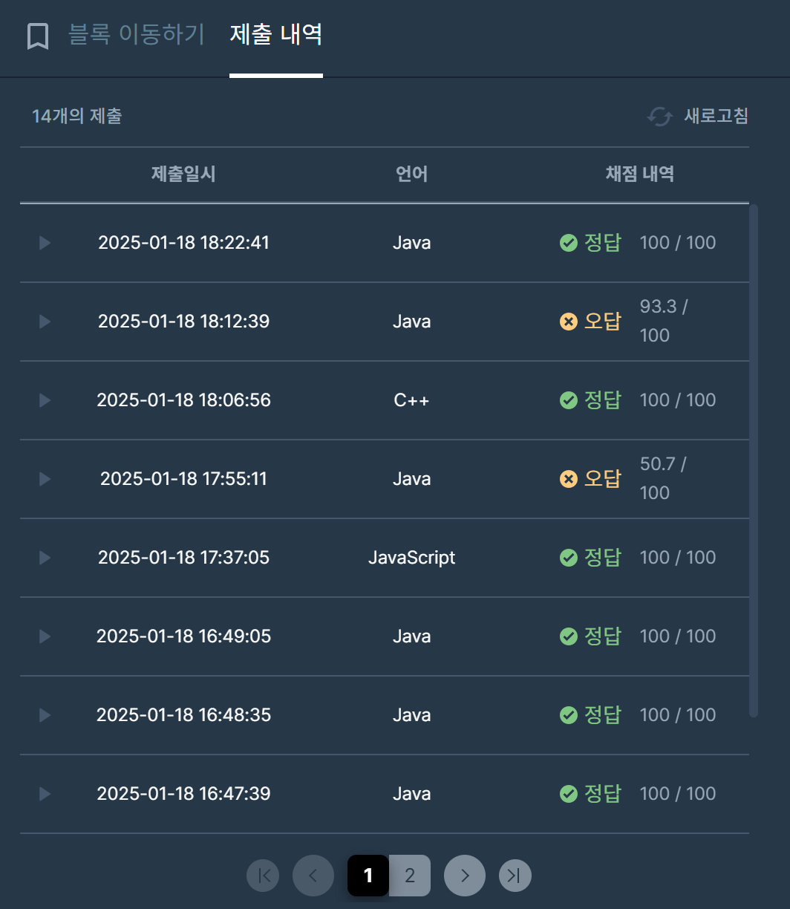

## [프로그래머스 Lv3. 블록 이동하기](https://school.programmers.co.kr/learn/courses/30/lessons/60063)

> 문제 키워드

-  2*1 크기의 로봇 (두 칸을 차지)
-  맵 정보 : 0(이동 가능), 1(벽)
-  조건에 따라 회전 가능
-  N,N 까지 이동하는데 걸리는 최소 시간
-  항상 목적지에 도착할 수 있는 경우만 입력

<br/>

> 접근법

-  다익스트라 -> BFS로 변경
-  방문 체크 -> [N][N][N][N] 2개의 좌표에 대해 기록
-  회전 로직 -> 위,아래 두 칸을 먼저 확인 -> 한 쪽을 고정, 나머지 쪽의 좌표를 이동

<br/>

> 시간 복잡도

#### O(N^4)

가능한 상태의 경우의 수 : N^4 -> 완전 탐색

<br/>

### 구현 코드

```java
import java.util.*;

class Solution {
    static class Robot { //정의 객체
        int x1, y1, x2, y2, cnt;
        public Robot(int x1, int y1, int x2, int y2, int cnt) {
            this.x1 = x1;
            this.y1 = y1;
            this.x2 = x2;
            this.y2 = y2;
            this.cnt = cnt;
        }
    }

    static int N;
    public int solution(int[][] board) {
        N = board.length;
        
        return bfs(board);
    }

    static int[] dx = {0, 0, 1, -1}; // 이동 방향 (상, 하, 좌, 우)
    static int[] dy = {1, -1, 0, 0};

    static int bfs(int[][] map) {
        Queue<Robot> q = new ArrayDeque<>();
        boolean[][][][] visited = new boolean[N][N][N][N];
        // (x1,y1) + (x2,y2) + (수평/수직) -> head의 위치에 따라 별도 체크가 안됨.

        q.offer(new Robot(0, 0, 0, 1, 0));
        visited[0][0][0][1] = true;

        while (!q.isEmpty()) {
            Robot cur = q.poll();

            // 목표 지점 도달
            if ((cur.x1 == N - 1 && cur.y1 == N - 1) || (cur.x2 == N - 1 && cur.y2 == N - 1)) {
                return cur.cnt;
            }

            // Step 1. 사방탐색
            for (int i = 0; i < 4; i++) {
                int nx1 = cur.x1 + dx[i];
                int ny1 = cur.y1 + dy[i];
                int nx2 = cur.x2 + dx[i];
                int ny2 = cur.y2 + dy[i];

                if (isValid(nx1, ny1, nx2, ny2, map) || visited[nx1][ny1][nx2][ny2]) continue;
                visited[nx1][ny1][nx2][ny2] = true;
                visited[nx2][ny2][nx1][ny1] = true;
                q.offer(new Robot(nx1, ny1, nx2, ny2, cur.cnt + 1));
                
            }

            // Step 2. 회전
            if (cur.x1 == cur.x2) { // 수평
                for (int d = -1; d <= 1; d += 2) { //-1, 1
                    if (isValid(cur.x1 + d, cur.y1, cur.x2 + d, cur.y2, map)) continue;
                    if (visited[cur.x1][cur.y1][cur.x1 + d][cur.y1]) continue; //head 고정
                    
                    visited[cur.x1][cur.y1][cur.x1 + d][cur.y1] = true;
                    visited[cur.x1 + d][cur.y1][cur.x1][cur.y1] = true;
                    q.offer(new Robot(cur.x1, cur.y1, cur.x1 + d, cur.y1, cur.cnt + 1));
                    
                    if (visited[cur.x2][cur.y2][cur.x2 + d][cur.y2]) continue; //tail 고정
                    
                    visited[cur.x2][cur.y2][cur.x2 + d][cur.y2] = true;
                    visited[cur.x2 + d][cur.y2][cur.x2][cur.y2] = true;
                    q.offer(new Robot(cur.x2, cur.y2, cur.x2 + d, cur.y2, cur.cnt + 1));
                }
            } else { // 수직
                for (int d = -1; d <= 1; d += 2) {
                    if (isValid(cur.x1, cur.y1 + d, cur.x2, cur.y2 + d, map)) continue;
                    if (visited[cur.x1][cur.y1][cur.x1][cur.y1 + d]) continue;
                    
                    visited[cur.x1][cur.y1][cur.x1][cur.y1 + d] = true;
                    visited[cur.x1][cur.y1 + d][cur.x1][cur.y1] = true;
                    q.offer(new Robot(cur.x1, cur.y1, cur.x1, cur.y1 + d, cur.cnt + 1));
                    
                    if (visited[cur.x2][cur.y2][cur.x2][cur.y2 + d]) continue;
                    
                    visited[cur.x2][cur.y2][cur.x2][cur.y2 + d] = true;
                    visited[cur.x2][cur.y2 +d][cur.x2][cur.y2] = true;
                    q.offer(new Robot(cur.x2, cur.y2, cur.x2, cur.y2 + d, cur.cnt + 1));
                }
            }
        }

        return -1;
    }

    static boolean isValid(int x1, int y1, int x2, int y2, int[][] map) {
        return x1<0 || y1<0 || x2<0 || y2<0 || x1>=N || y1>=N || x2>=N || y2>=N || map[x1][y1] == 1 || map[x2][y2] == 1;
    }
}
```

### 제출 결과

> 제출 결과

> 

> 스터디 정리
- 다익스트라와 BFS의 차이가 발생하는 경우
- BFS는 모든 노드를 동일한 거리로 탐색 -> 가중치가 동일하다면 도착 좌표에 대해 최단임을 보장함 (방문체크를 한다는 가정하에)
- : 그렇기 때문에 이번 문제의 경우 다익스트라와 BFS가 동일한 결과값을 전달함.
- 이번 문제의 경우 두 개의 좌표를 차지하기 때문에 (1,1),(2,1)과 (2,1)(1,1)에 대해서 같은 형태로 도착하는 경우가 있음.
- : 이 경우에 추가적으로 상대적인 좌표에 대한 방문 체크를 함으로써 불필요한 탐색을 줄일 수 있음.


> 구현 알고리즘
<p> BFS </p>

> 풀이 링크

[Private Solve](https://github.com/The-Four-Error-Pickers/Algorithm-Study/tree/main/Private%20Solve/1832.%20%EB%B3%B4%ED%96%89%EC%9E%90%20%EC%B2%9C%EA%B5%AD/Be-HinD(Ryo))
