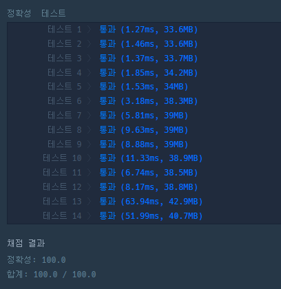

## [프로그래머스 Lv3. 블록 이동하기](https://school.programmers.co.kr/learn/courses/30/lessons/60063)

> 문제의 키워드

- 로봇은 2 x 1 크기
- board 크기는 최대 100 x 100
- 0은 빈칸, 1은 벽
- 4방 이동, 회전 가능 --> 1초 씩 소모
- N, N 위치까지 이동할 때 필요한 최소 시간 return

<br/>

> 접근법 분석

- BFS + 구현 으로 진행
- 기존 board 크기를 2 증가시켜 로봇이 바깥으로 나가는 경우를 처리
- 로봇이 가로일 때와 세로 일때 구분하여 회전시킴

<br/>

> 시간복잡도

#### O(N^2)

<br/>

### 구현 코드

```javascript
const dy = [-1, 1, 0, 0];
const dx = [0, 0, -1, 1];
const rotate = [1, -1];

const getNextPosition = ([hy, hx], [ty, tx], board, time) => {
  const arr = [];

  for (let i = 0; i < 4; i++) {
    const [nhy, nhx] = [hy + dy[i], hx + dx[i]];
    const [nty, ntx] = [ty + dy[i], tx + dx[i]];

    if (board[nhy][nhx] === 1 || board[nty][ntx] === 1) continue;

    arr.push({ head: [nhy, nhx], tail: [nty, ntx], time: time + 1 });
  }

  rotate.forEach((v) => {
    if (hy === ty) {
      // 가로인 경우
      if (board[hy + v][hx] === 0 && board[ty + v][tx] === 0) {
        arr.push({ head: [hy, hx], tail: [hy + v, hx], time: time + 1 });
        arr.push({ head: [ty + v, tx], tail: [ty, tx], time: time + 1 });
      }
    } else {
      // 세로인 경우
      if (board[hy][hx + v] === 0 && board[ty][tx + v] === 0) {
        arr.push({ head: [hy, hx], tail: [hy, hx + v], time: time + 1 });
        arr.push({ head: [ty, tx + v], tail: [ty, tx], time: time + 1 });
      }
    }
  });

  return arr;
};

function solution(board) {
  const N = board.length;
  const goal = `${N}${N}`;

  const newBoard = Array.from({ length: N + 2 }, () => Array(N + 2).fill(1));
  for (let i = 0; i < N; i++) {
    for (let j = 0; j < N; j++) {
      newBoard[i + 1][j + 1] = board[i][j];
    }
  }

  const queue = [];
  const visited = new Set();

  queue.push({ head: [1, 1], tail: [1, 2], time: 0 });
  const visit = new Set(['1112']);

  while (queue.length) {
    const { head, tail, time } = queue.shift();

    if (head.join('') === goal || tail.join('') === goal) return time;

    const nextPos = getNextPosition(head, tail, newBoard, time);

    for (const next of nextPos) {
      const { head: nextHead, tail: nextTail } = next;

      const key = nextHead.join('') + nextTail.join('');
      if (!visited.has(key)) {
        visited.add(key);
        queue.push(next);
      }
    }
  }
}
```

### 제출 결과



#### 풀이 링크

[Private Solve](https://github.com/The-Four-Error-Pickers/Algorithm-Study/tree/main/Private%20Solve/60063.%20%EB%B8%94%EB%A1%9D%20%EC%9D%B4%EB%8F%99%ED%95%98%EA%B8%B0/hyun812/2025-01-16T192153)
