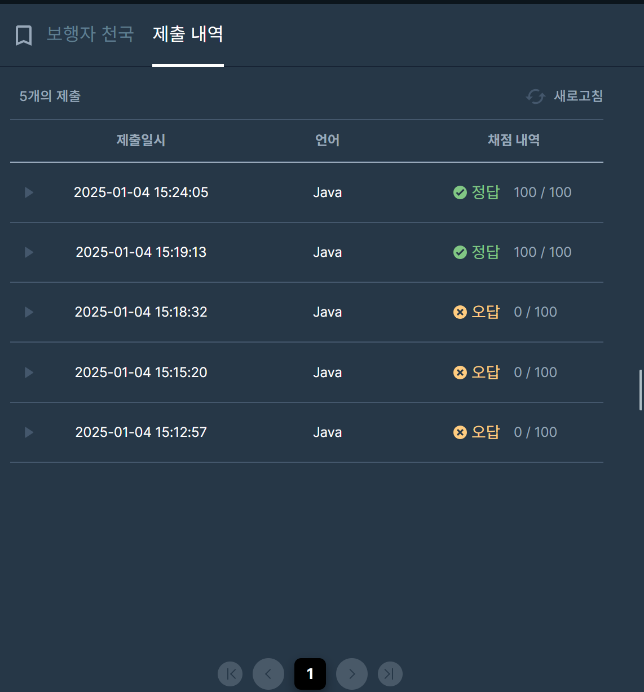

## [프로그래머스 Lv3. 보행자 천국](https://school.programmers.co.kr/learn/courses/30/lessons/1832#qna)

> 문제 키워드

-  오른쪽 또는 아래 방향으로 한 칸씩 이동
- 0인 경우에는 자동차가 자유롭게 지나갈 수 있다.
- 1인 경우에는 이동금지
- 2인 경우에는 이전 방향 그대로만 이동 가능

<br/>

> 접근법

-  프로그래머스 등굣길과 유사한 DP 경우의 수 문제
-  다른 점은 0,1,2 값에 따른 경우의 수 조건처리가 추가됨.
-  왼쪽에서 오는 경우, 위쪽에서 오는 경우를 따로 저장
-  현재 좌표(i,j) 기준으로 이전 좌표 [i-1][j], [i][j-1]의 2 여부를 확인하며 업데이트

<br/>

> 시간 복잡도

#### O(m*n)

2차원 배열 원소 개수

<br/>

### 구현 코드

```java
import java.util.*;
class Solution {
    int MOD = 20170805;
    public int solution(int m, int n, int[][] cityMap) {
        
        int[][][] dp = new int[m+1][n+1][2];
        
        //전처리
        for(int i=1; i<=n; i++) {
            if(cityMap[0][i-1] == 1) break;
            dp[1][i][0] = 1;
        }
        for(int i=1; i<=m ;i++) {
            if(cityMap[i-1][0] == 1) break;
            dp[i][1][1] = 1;
        }
        
        for(int i=2; i<=m; i++) {
            for(int j=2; j<=n; j++) {
                if(cityMap[i-1][j-1] == 1) continue;
                
                if(cityMap[i - 2][j - 1] == 2) {
                    dp[i][j][1] = (dp[i][j][1] + dp[i-1][j][1]) % MOD;
                }
                else {
                    dp[i][j][1] = (dp[i][j][1] + dp[i-1][j][0] + dp[i-1][j][1]) % MOD;
                }

                if(cityMap[i-1][j-2] == 2) {
                    dp[i][j][0] = (dp[i][j][0] + dp[i][j-1][0]) % MOD;
                }
                else {
                    dp[i][j][0] = (dp[i][j][0] + dp[i][j-1][0] + dp[i][j-1][1]) % MOD;
                }
            }
        }
        
        return (dp[m][n][0] + dp[m][n][1]) % MOD;
    }
}
```

### 제출 결과

> 제출 결과

> 

> 스터디 정리
- 스터디 중에 접근은 등굣길과 유사하게 코드를 구성했다.
- 2의 조건처리 부분을 누락하여 새로운 접근법을 생각했고, 그 사이에 생각정리가 잘 되지 않은 듯 했다.
- 3차원 배열로 경로에 따른 저장이 아닌, 2의 경우에만 따로 저장을 해야겠다는 생각만 하고 있었다.
- 스터디가 끝나고 천천히 생각해보니 다른 스터디원의 풀이처럼 별도로 저장했을 경우에 쉽게 풀이가 되는걸 확인.
- 나의 경우 현재 좌표를 기준으로 이전값을 확인하는 케이스를 좋아하는데, 이후에 다음좌표를 기준으로도 해보고 비교해봐야겠다.
- + 하향식도 해봐야될텐데....


> 구현 알고리즘
<p> DP </p>

> 풀이 링크

[Private Solve](https://github.com/The-Four-Error-Pickers/Algorithm-Study/tree/main/Private%20Solve/1832.%20%EB%B3%B4%ED%96%89%EC%9E%90%20%EC%B2%9C%EA%B5%AD/Be-HinD(Ryo))
